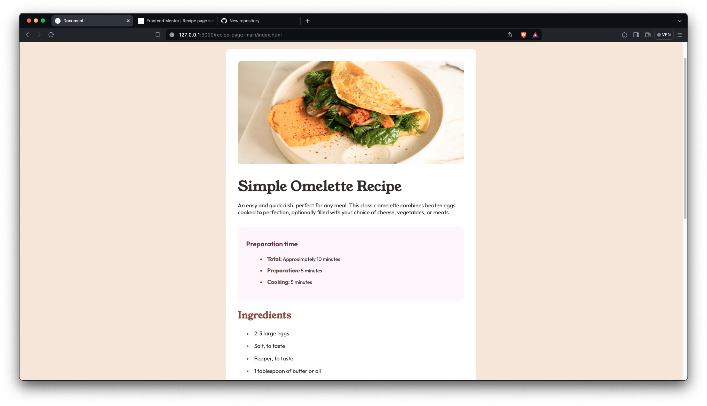
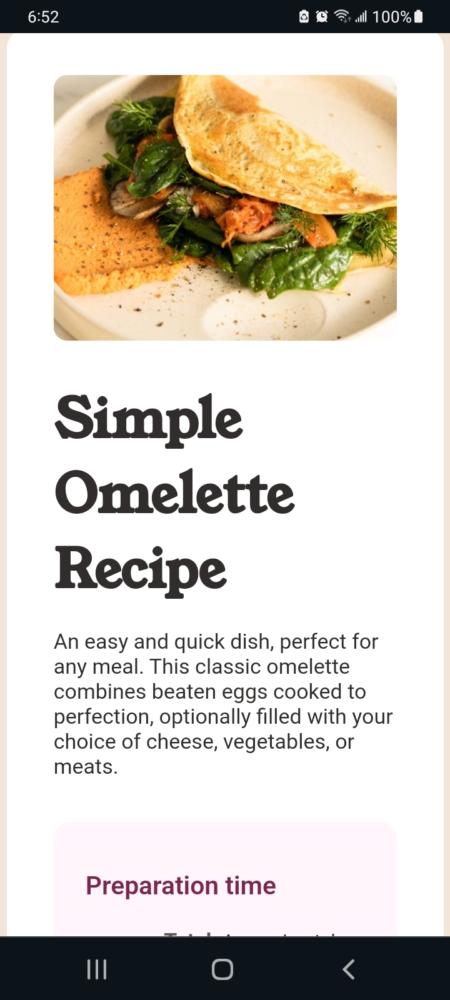

# Frontend Mentor - Recipe page solution

This is a solution to the [Recipe page challenge on Frontend Mentor](https://www.frontendmentor.io/challenges/recipe-page-KiTsR8QQKm). Frontend Mentor challenges help you improve your coding skills by building realistic projects. 

## Table of contents

- [Overview](#overview)
- [Screenshots](#screenshots)
- [Links](#links)
- [My process](#my-process)
- [Built with](#built-with)
- [Continued development](#continued-development)
- [Author](#author)

## Overview

This is my solution to the Recipe Page challenge.

### Screenshots

### Links

- Solution URL: [Add solution URL here](https://your-solution-url.com)
- Live Site URL: [Add live site URL here](https://your-live-site-url.com)

## My process

- HTML and CSS coded in Visual Code

### Built with

- Semantic HTML5 markup
- CSS custom properties
- Flexbox
- CSS Grid
- Visual Studio Code

### Continued development

HTML5, CSS, and Javascript

## Author

- CodePen - [Devon Hughes](https://codepen.io/Devon-Hughes-the-decoder)
- Frontend Mentor - [@DevonHughesCodes](https://www.frontendmentor.io/profile/DevonHughesCodes)
- Twitter - [@HughesDevDesign](https://twitter.com/HughesDevDesign)
